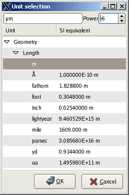

<H2>Units of Measurement for Ada</H2>

<table border="0" cellpadding="0">
<tr>
<td valign="top">The need of support for handling measurement units does not require any approval.
It is in particular true for the Ada programming language with its stress
on safety and maintainability. The proposed set of packages represents a
possible solution of the unit problem. Dimension checking is performed at
run-time, so performance is sacrificed for safety. However, an attempt was
made to reduce performance hit. The type Measure used to represent dimensioned
values can be constrained to a specific unit. Operations on constrained subtypes
of Measure could be potentially as efficient as floating-point operations.
They are declared inlined, so that at least theoretically, a decent compiler
could perform discriminant calculation and check at compile time.

The key features of the approach:
<UL>
  <LI>
    The type Unit denotes the dimension of a physical entity. The type Measure
    represents a dimensioned value;
  <LI>
    Mixed unit arithmetic. Values in SI
    (<A href="http://physics.nist.gov/cuu/Units/index.html">Le
    <B>S</B>yst&egrave;me <B>I</B>nternational d'Unit&eacute;s</A>) units can
    be mixed with irregular units (such as foot and yard) as long as the result
    is defined;
  <LI>
    Shifted unit support (a widely used instance of a shifted unit is degree
    of Celsius);
  <LI>
    The type Measure is generic, parameterized by a floating-point type. A
    non-generic version based on the type Float is also provided;
  <LI>
    String to Measure conversion supports as wide set of irregular units as 
	possible;<LI>
    Currently the powers of the base unit components lie in the range -8..7. 
	This limitation has an implementation reason (absence of 64-bit modular 
	integers in some Ada compilers). For further discussion of this topic
    <A href="#64-bit">see</A>;<LI>
	<a href="http://www.gtk.org">GTK+</a> widgets for a comfortable visual 
	measurement unit editing and selection. The rest of the library can be used 
	independently on this part as well as on <a href="http://www.gtk.org">GTK+</a>.</UL>
</td>
<td valign="top">&nbsp;
</td>
<td valign="top">
</td>
</tr>
</table>

Home page: https://www.dmitry-kazakov.de/ada/units.htm

Changes log: https://www.dmitry-kazakov.de/ada/units.htm#changes_log
